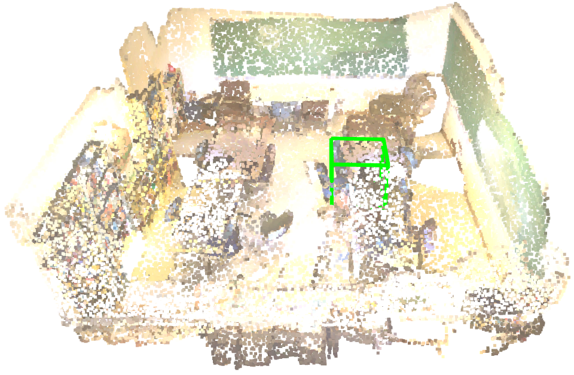

# 3D Bounding Box with Open3D

This repository shows some examples on how to visualize 3D grounding boxes with [Open3D](https://www.open3d.org/).

# Usage
## Environment Setup

```bash
conda create -n 3d python=3.10
conda activate 3d
pip install -r requirements.txt
```
## Run
```bash
cd MainScene
python3 cylinder_boxes.py
```

# Visualization
Main Scene 

3D Dense Caption 

3D Visual Grounding
